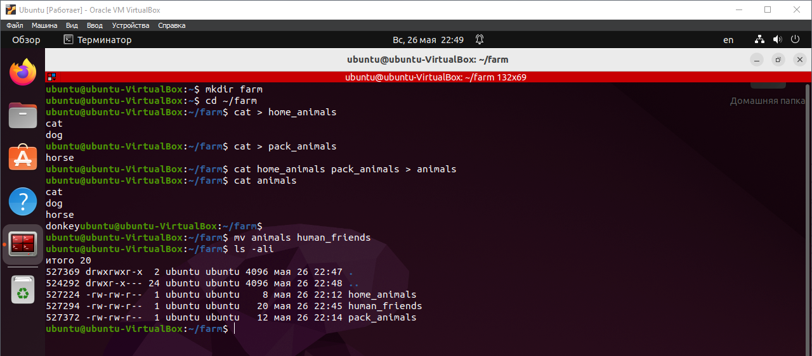
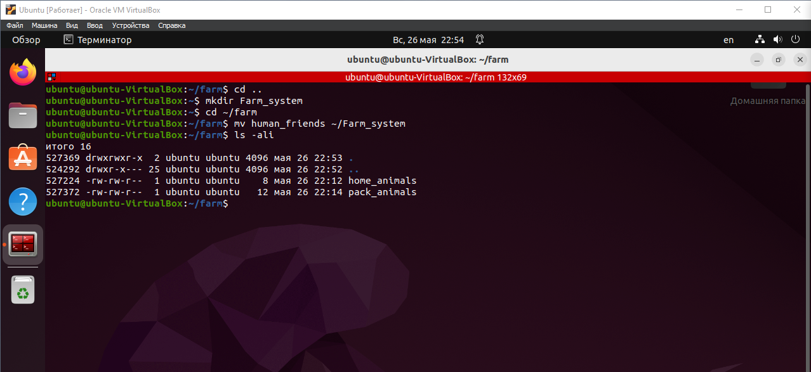
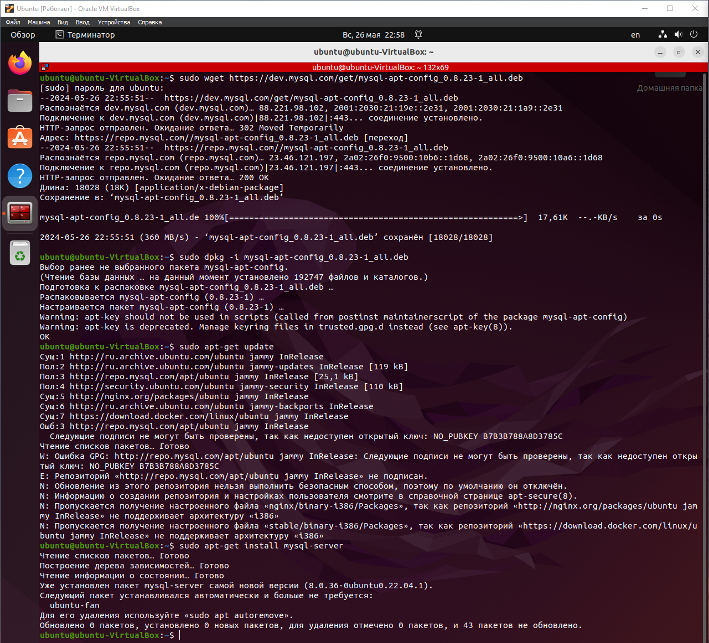
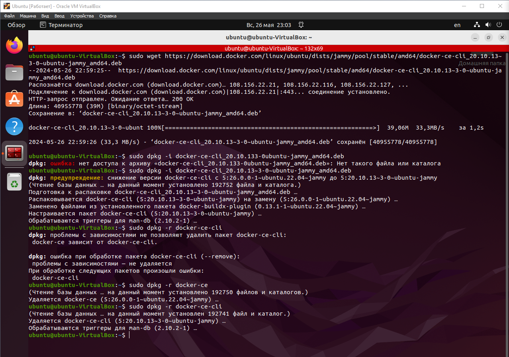
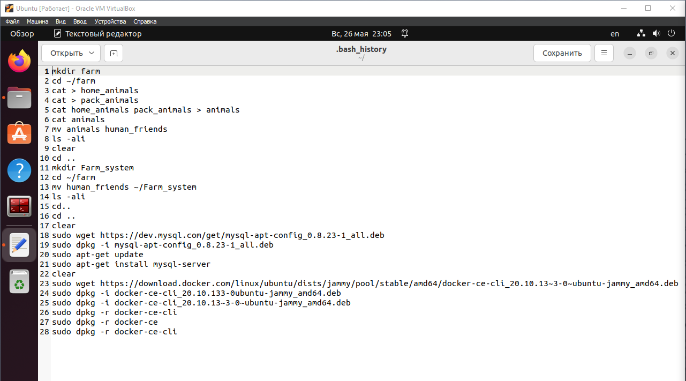
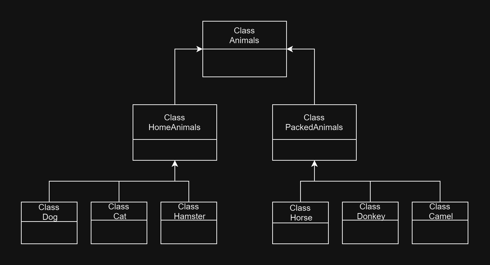
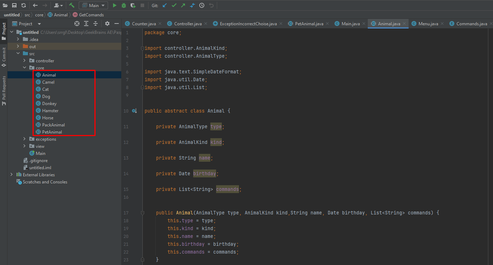

# Задание
1. Используя команду cat в терминале операционной системы Linux, создать
два файла Домашние животные (заполнив файл собаками, кошками,
хомяками) и Вьючные животными заполнив файл Лошадьми, верблюдами и
ослы), а затем объединить их. Просмотреть содержимое созданного файла.
Переименовать файл, дав ему новое имя (Друзья человека). 



2. Создать директорию, переместить файл туда.



3. Подключить дополнительный репозиторий MySQL. Установить любой пакет
из этого репозитория.



4. Установить и удалить deb-пакет с помощью dpkg.



5. Выложить историю команд в терминале ubuntu   
([Ссылка](https://github.com/sergey-loev/Receiver_accounting_system/blob/master/bash_history.md "Перейти к файлу истории"))



6. Нарисовать диаграмму, в которой есть класс родительский класс, домашние
животные и вьючные животные, в составы которых в случае домашних
животных войдут классы: собаки, кошки, хомяки, а в класс вьючные животные
войдут: Лошади, верблюды и ослы).  
([Ссылка](https://github.com/sergey-loev/Receiver_accounting_system/blob/master/Animals_UML.drawio "Перейти к файлу .drawio"))



7. В подключенном MySQL репозитории создать базу данных “Друзья
человека”  
([Ссылка](https://github.com/sergey-loev/Receiver_accounting_system/blob/master/Human_friends.sql "Перейти к файлу .drawio"))
``` SQL
DROP DATABASE IF EXISTS human_friends;
CREATE DATABASE human_friends;
USE human_friends;
```
8. Создать таблицы с иерархией из диаграммы в БД  
([Ссылка](https://github.com/sergey-loev/Receiver_accounting_system/blob/master/Human_friends.sql "Перейти к файлу .drawio"))
``` SQL
CREATE TABLE animal_classes
(
	id INT AUTO_INCREMENT PRIMARY KEY, 
	class_name VARCHAR(20)
);

CREATE TABLE packed_animals
(
	id INT AUTO_INCREMENT PRIMARY KEY,
    genus_name VARCHAR (20),
    class_id INT,
    FOREIGN KEY (class_id) REFERENCES animal_classes (id) ON DELETE CASCADE ON UPDATE CASCADE
);

CREATE TABLE home_animals
(
	id INT AUTO_INCREMENT PRIMARY KEY,
    genus_name VARCHAR (20),
    class_id INT,
    FOREIGN KEY (class_id) REFERENCES animal_classes (id) ON DELETE CASCADE ON UPDATE CASCADE
);

CREATE TABLE cats 
(       
    id INT AUTO_INCREMENT PRIMARY KEY, 
    name VARCHAR(20), 
    birthday DATE,
    commands VARCHAR(50),
    genus_id int,
    Foreign KEY (genus_id) REFERENCES home_animals (id) ON DELETE CASCADE ON UPDATE CASCADE
);

CREATE TABLE dogs 
(       
    id INT AUTO_INCREMENT PRIMARY KEY, 
    name VARCHAR(20), 
    birthday DATE,
    commands VARCHAR(50),
    genus_id int,
    Foreign KEY (genus_id) REFERENCES home_animals (id) ON DELETE CASCADE ON UPDATE CASCADE
);

CREATE TABLE hamsters 
(       
    id INT AUTO_INCREMENT PRIMARY KEY, 
    name VARCHAR(20), 
    birthday DATE,
    commands VARCHAR(50),
    genus_id int,
    Foreign KEY (genus_id) REFERENCES home_animals (id) ON DELETE CASCADE ON UPDATE CASCADE
);

CREATE TABLE horses 
(       
    id INT AUTO_INCREMENT PRIMARY KEY, 
    name VARCHAR(20), 
    birthday DATE,
    commands VARCHAR(50),
    genus_id int,
    Foreign KEY (genus_id) REFERENCES packed_animals (id) ON DELETE CASCADE ON UPDATE CASCADE
);

CREATE TABLE donkeys 
(       
    id INT AUTO_INCREMENT PRIMARY KEY, 
    name VARCHAR(20), 
    birthday DATE,
    commands VARCHAR(50),
    genus_id int,
    Foreign KEY (genus_id) REFERENCES packed_animals (id) ON DELETE CASCADE ON UPDATE CASCADE
);

CREATE TABLE camels 
(       
    id INT AUTO_INCREMENT PRIMARY KEY, 
    name VARCHAR(20), 
    birthday DATE,
    commands VARCHAR(50),
    genus_id int,
    Foreign KEY (genus_id) REFERENCES packed_animals (id) ON DELETE CASCADE ON UPDATE CASCADE
);
```
9. Заполнить низкоуровневые таблицы именами(животных), командами
которые они выполняют и датами рождения  
([Ссылка](https://github.com/sergey-loev/Receiver_accounting_system/blob/master/Human_friends.sql "Перейти к файлу .drawio"))
``` SQL
INSERT INTO animal_classes (class_name)
VALUES ('Вьючные'),
('Домашние');  

INSERT INTO packed_animals (genus_name, class_id)
VALUES ('Лошади', 1),
('Ослы', 1),  
('Верблюды', 1); 
    
INSERT INTO home_animals (genus_name, class_id)
VALUES ('Кошки', 2),
('Собаки', 2),  
('Хомяки', 2); 

INSERT INTO cats (name, birthday, commands, genus_id)
VALUES ('Барсик', '2015-06-10', 'Спать, Есть, Играть', 1),
('Вискас', '2019-01-15', 'Сальто, Есть, Лежать', 1), 
('Люцифер', '2006-06-06', 'Тыгыдык, Куси, Торнадо', 1),  
('Феликс', '2017-09-01', 'Лежать, Умойся, Кушать', 1); 

INSERT INTO dogs (name, birthday, commands, genus_id)
VALUES ('Рекс', '2020-10-01', 'Ко-мне, Лежать, Лапу, Голос', 2),
('Барон', '2021-03-02', 'Сидеть, Лежать, Лапу', 2),  
('Дюк', '2019-05-11', 'Рядом, К ноге, Сидеть, Ищи, Можно', 2), 
('Багет', '2020-05-03', 'Сидеть, Лежать, Нельзя, Место', 2);

INSERT INTO hamsters (name, birthday, commands, genus_id)
VALUES ('Пинки', '2023-10-12', 'Фас', 3),
('Брейн', '2023-03-12','Стоять' , 3),  
('Плаксик', '2022-07-11', 'Колесо', 3), 
('Пепа', '2022-05-10', 'Умри', 3);

INSERT INTO horses (name, birthday, commands, genus_id)
VALUES ('Пегас', '2020-01-12', 'Рысь, Галоп', 1),
('Минимус', '2017-03-12', 'Пррр, Но, Хоп-хоп', 1),  
('Максимус', '2016-07-12', 'Бегом, Шагом, Пррр', 1), 
('Даш', '2020-11-10', 'Рысь, Галоп, Айя', 1);

INSERT INTO donkeys (name, birthday, commands, genus_id)
VALUES ('Амбал', '2019-04-10', 'Вперед, Стоять, Ждать', 2),
('Бугай', '2020-03-12', 'Вперед, Стоять', 2),  
('Тяни', '2021-07-12', 'Толкай', 2), 
('Толкай', '2022-12-10', 'Тяни', 2);

INSERT INTO camels (name, birthday, commands, genus_id)
VALUES ('Бархан', '2022-04-10', 'Иди, Стой, Кушай', 3),
('Караван', '2019-03-12', 'Стой, Кушай', 3),  
('Казбек', '2015-07-12', 'Иди, Кушай', 3), 
('Захар', '2022-12-10', 'Иди, Стой', 3);
```
10. Удалив из таблицы верблюдов, т.к. верблюдов решили перевезти в другой
питомник на зимовку. Объединить таблицы лошади, и ослы в одну таблицу.  
([Ссылка](https://github.com/sergey-loev/Receiver_accounting_system/blob/master/Human_friends.sql "Перейти к файлу .drawio"))
``` SQL
SET SQL_SAFE_UPDATES = 0;
DELETE FROM camels;

CREATE TABLE horses_donkeys AS
SELECT name, birthday, commands FROM horses
UNION SELECT name, birthday, commands FROM donkeys;
```
11. Создать новую таблицу “молодые животные” в которую попадут все
животные старше 1 года, но младше 3 лет и в отдельном столбце с точностью
до месяца подсчитать возраст животных в новой таблице  
([Ссылка](https://github.com/sergey-loev/Receiver_accounting_system/blob/master/Human_friends.sql "Перейти к файлу .drawio"))
``` SQL
CREATE TABLE yang_animal AS
SELECT name, birthday, commands, genus_id, TIMESTAMPDIFF(MONTH, Birthday, CURDATE()) AS Age_in_month
FROM horses WHERE birthday BETWEEN ADDDATE(curdate(), INTERVAL -3 YEAR) AND ADDDATE(CURDATE(), INTERVAL -1 YEAR)
UNION SELECT name, birthday, commands, genus_id, TIMESTAMPDIFF(MONTH, Birthday, CURDATE()) AS Age_in_month
FROM donkeys WHERE birthday BETWEEN ADDDATE(curdate(), INTERVAL -3 YEAR) AND ADDDATE(CURDATE(), INTERVAL -1 YEAR)
UNION SELECT name, birthday, commands, genus_id, TIMESTAMPDIFF(MONTH, Birthday, CURDATE()) AS Age_in_month
FROM dogs WHERE birthday BETWEEN ADDDATE(curdate(), INTERVAL -3 YEAR) AND ADDDATE(CURDATE(), INTERVAL -1 YEAR)
UNION SELECT name, birthday, commands, genus_id, TIMESTAMPDIFF(MONTH, Birthday, CURDATE()) AS Age_in_month
FROM cats WHERE birthday BETWEEN ADDDATE(curdate(), INTERVAL -3 YEAR) AND ADDDATE(CURDATE(), INTERVAL -1 YEAR)
UNION SELECT name, birthday, commands, genus_id, TIMESTAMPDIFF(MONTH, Birthday, CURDATE()) AS Age_in_month
FROM hamsters WHERE birthday BETWEEN ADDDATE(curdate(), INTERVAL -3 YEAR) AND ADDDATE(CURDATE(), INTERVAL -1 YEAR);
```
12. Объединить все таблицы в одну, при этом сохраняя поля, указывающие на
прошлую принадлежность к старым таблицам.  
([Ссылка](https://github.com/sergey-loev/Receiver_accounting_system/blob/master/Human_friends.sql "Перейти к файлу .drawio"))
``` SQL
CREATE TABLE animals AS
SELECT horses.id, horses.name, horses.birthday, horses.commands, pa.genus_name, ac.class_name
FROM horses
LEFT JOIN packed_animals pa ON pa.id = horses.genus_id
LEFT JOIN animal_classes ac ON ac.id =pa.class_id
UNION SELECT donkeys.id, donkeys.name, donkeys.birthday, donkeys.commands, pa.genus_name, ac.class_name
FROM donkeys
LEFT JOIN packed_animals pa ON pa.id = donkeys.genus_id
LEFT JOIN animal_classes ac ON ac.id =pa.class_id 
UNION SELECT dogs.id, dogs.name, dogs.birthday, dogs.commands, ha.genus_name, ac.class_name
FROM dogs
LEFT JOIN home_animals ha ON ha.id = dogs.genus_id
LEFT JOIN animal_classes ac ON ac.id =ha.class_id
UNION SELECT cats.id, cats.name, cats.birthday, cats.commands, ha.genus_name, ac.class_name
FROM cats
LEFT JOIN home_animals ha ON ha.id = cats.genus_id
LEFT JOIN animal_classes ac ON ac.id =ha.class_id
UNION SELECT hamsters.id, hamsters.name, hamsters.birthday, hamsters.commands, ha.genus_name, ac.class_name
FROM hamsters
LEFT JOIN home_animals ha ON ha.id = hamsters.genus_id
LEFT JOIN animal_classes ac ON ac.id =ha.class_id
```
13. Создать класс с Инкапсуляцией методов и наследованием по диаграмме.  



14. Написать программу, имитирующую работу реестра домашних животных.
В программе должен быть реализован следующий функционал:
    14.1 Завести новое животное  
    14.2 Определять животное в правильный класс  
    14.3 Увидеть список команд, которое выполняет животное  
    14.4 Обучить животное новым командам  
    14.5 Реализовать навигацию по меню  
    ([Ссылка](https://github.com/sergey-loev/Receiver_accounting_system/blob/master/src "Перейти к проекту Java"))

15. Создайте класс Счетчик, у которого есть метод add(), увеличивающий
значение внутренней int переменной на 1 при нажатие “Завести новое
животное” Сделайте так, чтобы с объектом такого типа можно было работать в
блоке try-with-resources. Нужно бросить исключение, если работа с объектом
типа счетчик была не в ресурсном try и/или ресурс остался открыт. Значение
считать в ресурсе try, если при заведения животного заполнены все поля.
 ([Ссылка](https://github.com/sergey-loev/Receiver_accounting_system/blob/master/src "Перейти к проекту Java"))